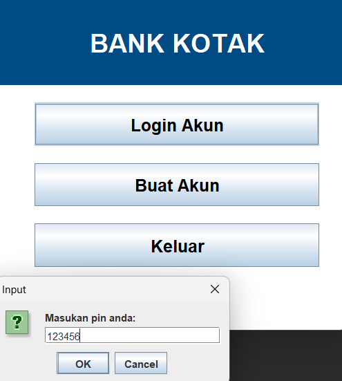

# [Bank_Application] - Application Project

## Overview
This Application is made for the final project for Algorithm & Programming. An app that my friend Ayman and I took as a learning platform on making a simple data base through file-based saving, making a UI application using Java Swing & reading and saving data from the file to the UI.

## Role
- Making how the UI should look
- Database connection and manipulation (Login & Register credentials, Mentoring schedule & submission and transfer & information of the account)

## Purpose
- Learning about database through file-based
- Learning about UI's in java
- Learning to make a simple OOP concept on setters & getters
- Learning on how to make a dynamic app that helps me on future course

## Tools
- Java (Swing Library)

## Screenshot
### Login

### Account Balance

### Making Schedule

### Schedule for mentoring

To set up:  
1. Open `src` and search through the file and open `AFMenuSebelumLogin.java`
2. Run the program

## Live Demo
*(Check `To set up`)* 

